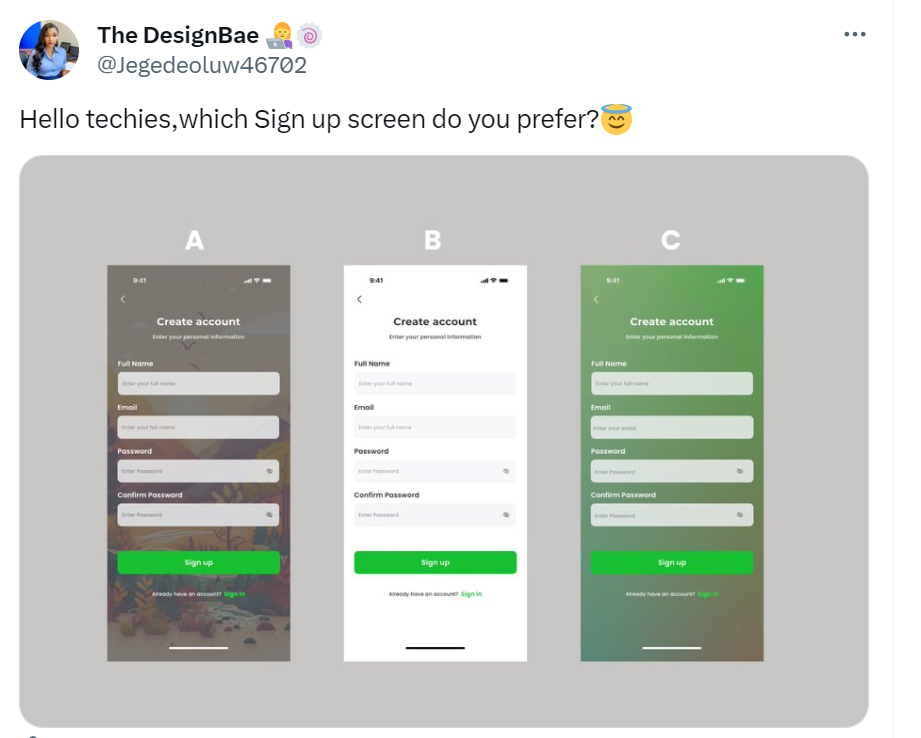
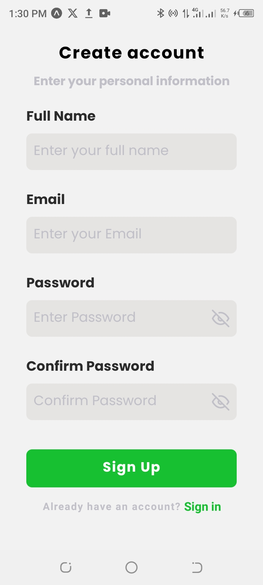
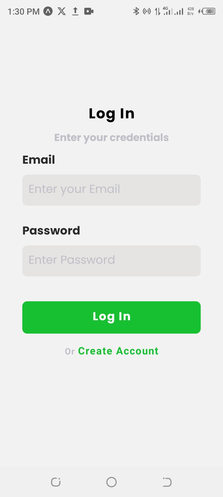
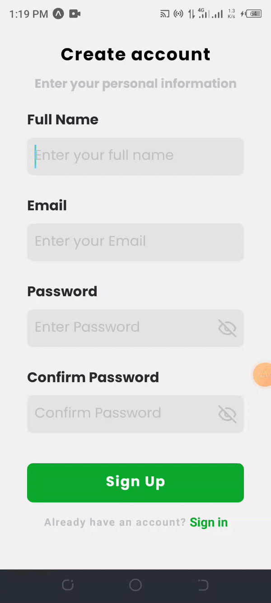

# Preview

This tiny project inspired by Oluwakemi Jegede a product designer who shared three screens (above) and let others to choose one.

Because most of them have chosen B, this is the frontend of the choice.   Developed using **React Native** with **Expo**    

## Want run?

Here are these steps to run the project locally  

1. Clone the repository
   git clone `https://github.com/isayaexavery/set-account.git`

2. Finally ,   `npx expo start`

**CREATE ACCOUNT SCREEN**  
  

**LOGIN SCREEN**  
  

**SCREEN**  
  
